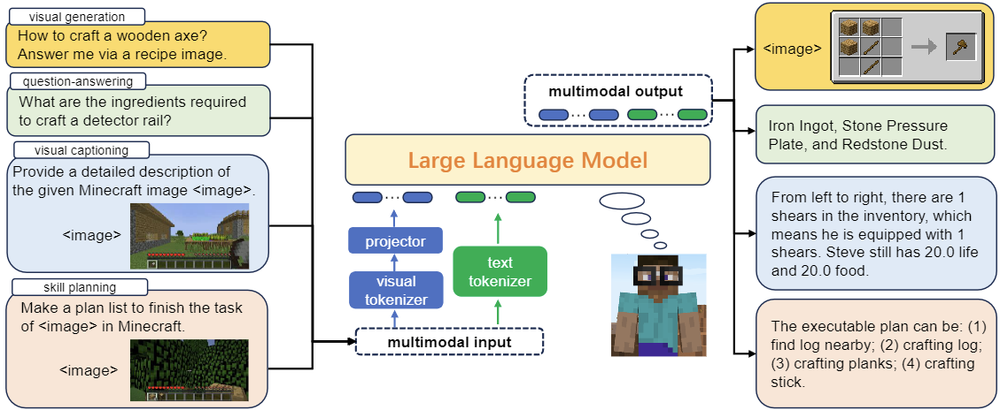
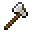
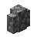

# STEVE-EYE: Equiping LLM-based Embodied Agents with Visual Perception in Open Worlds 
<div align="center">

[[Website]](https://sites.google.com/view/steve-eye) 
[[Arxiv Paper]](https://arxiv.org/abs/2310.13255)

[](https://pypi.org/project/MineDojo/)
[](https://pytorch.org/)
[](https://github.com/BAAI-Agents/SteveEye/blob/main/LICENSE)


<div align="left">

## Overview

Steve-Eye is an end-to-end trained large multimodal model to address this limitation, which integrates the LLM with a visual encoder to process visual-text inputs and generate multimodal feedback. 
We adopt a semi-automatic strategy to collect an extensive dataset comprising 850K open-world instruction pairs, enabling our model to encompass three essential functions for an agent: multimodal perception, foundational knowledge base, and skill prediction and planning.
Our contribution can be summarized as:

* **Open-World Instruction Dataset:** We construct instruction data for the acquisition of three mentioned functions, which contains not only the agent’s per-step status and environmental features but also the essential knowledge for agents to act and plan.

* **Large Multimodal Model and Training:** Steve-Eye combines a visual encoder which converts visual inputs into a sequence of embeddings, along with a pre-trained LLM which empowers embodied agents to engage in skill or task reasoning in an open world.

* **Open-World Benchmarks:** We develop the following benchmarks to evaluate agent performance from a broad range of perspectives: (1) environmental visual captioning (ENV-VC); (2) foundational knowledge question answering (FK-QA); (3) skill prediction and planning (SPP).


## Dataset
```
To be released soon
```

<div align="center">
    
</div>

## Environmental Visual Captioning (ENV-VC) Results
| Model          | Visual Encoder | Inventory  | Equip  | Object in Sight  | Life  | Food  | Sky  |
|----------------|----------------|-----------|-------|-----------------|------|------|-----|
| BLIP-2         | CLIP           | 41.6      | 58.5  | 64.7            | 88.5 | 87.9 | 57.6|
| Llama-2-7b     | -              | -         | -     | -               | -    | -    | -   |
| Steve-Eye-7b   | VQ-GAN         | 89.9      | 78.3  | 87.4            | 92.1 | 90.2 | 68.5|
| Steve-Eye-13b  | MineCLIP       | 44.5      | 61.8  | 72.2            | 89.2 | 88.6 | 68.2|
| Steve-Eye-13b  | VQ-GAN         | 91.1      | 79.6  | 89.8            | 92.7 | 90.8 | 72.7|
| Steve-Eye-13b  | CLIP           | **92.5**  | **82.8** | **92.1**     | **93.1** | **91.5** | **73.8** |

## Foundational Knowledge Question Answering (FK-QA) Results
|               | Scoring    |         |        |          | Accuracy |       |
|---------------|------------|---------|--------|----------|----------|-------|
|               | Wiki Page  | Wiki Table | Recipe | TEXT All | TEXT    | IMG   |
|---------------|------------|---------|--------|----------|----------|-------|
| Llama-2-7b    | 6.90       | 6.21    | 7.10   | 6.62     | 37.01%   | -     |
| Llama-2-13b   | 6.31 (-0.59)| 6.16 (-0.05)| 6.31 (-0.79)| 6.24 (-0.38)| 37.96%| - |
| Llama-2-70b   | 6.91 (+0.01)| 6.97 (+0.76)| 7.23 (+0.13)| 7.04 (+0.42)| 38.27%| - |
| gpt-turbo-3.5 | 7.26 (+0.36)| 7.15 (+0.94)| 7.97 (+0.87)| 7.42 (+0.80)| 41.78%| - |
| Steve-Eye-7b  | 7.21 (+0.31)| 7.28 (+1.07)| 7.82 (+0.72)| 7.54 (+0.92)| 43.25%| 62.83%|
| Steve-Eye-13b | 7.38 (+0.48)| 7.44 (+1.23)| 7.93 (+0.83)| 7.68 (+1.06)| 44.36%| 65.13%|


## Skill Planning Results
| Model          |  |  |  |  |  |  |  |  |  |  |  |  |  |  |
|----------------|-------|----------------|------|-------|----------|------|----------------|---------|--------------|------------|------------------|-------|-------|---------------|
| MineAgent      | 0.00  | 0.03           | 0.00 | 0.00  | 0.00     | 0.00 | 0.00           | 0.00    | 0.00         | 0.00       | 0.21             | 0.0   | 0.05  | 0.0           |
| gpt assistant  | 0.30  | 0.17           | 0.07 | 0.00  | 0.03     | 0.00 | 0.20           | 0.00    | 0.20         | 0.03       | 0.13             | 0.00  | 0.10  | 0.00          |
| Steve-Eye-auto | 0.30  | 0.27           | 0.37 | 0.23  | 0.20     | 0.17 | 0.26           | 0.07    | 0.13         | 0.17       | 0.20             | 0.33  | 0.00  | 0.13          |
| Steve-Eye      | **0.40** | **0.30**    | **0.43**| **0.53**| **0.33**| **0.37**| **0.43** | **0.30**| **0.43**    | **0.47**  | **0.47**        | **0.40**| **0.13**| **0.23**  |

## Citation
```
@article{zheng2023steve,
 	 title={Steve-Eye: Equipping LLM-based Embodied Agents with Visual Perception in Open Worlds},
 	 author={Zheng, Sipeng and Liu, Jiazheng and Feng, Yicheng and Lu, Zongqing},
  	journal={arXiv preprint arXiv:2310.13255},
  	year={2023}
}
```